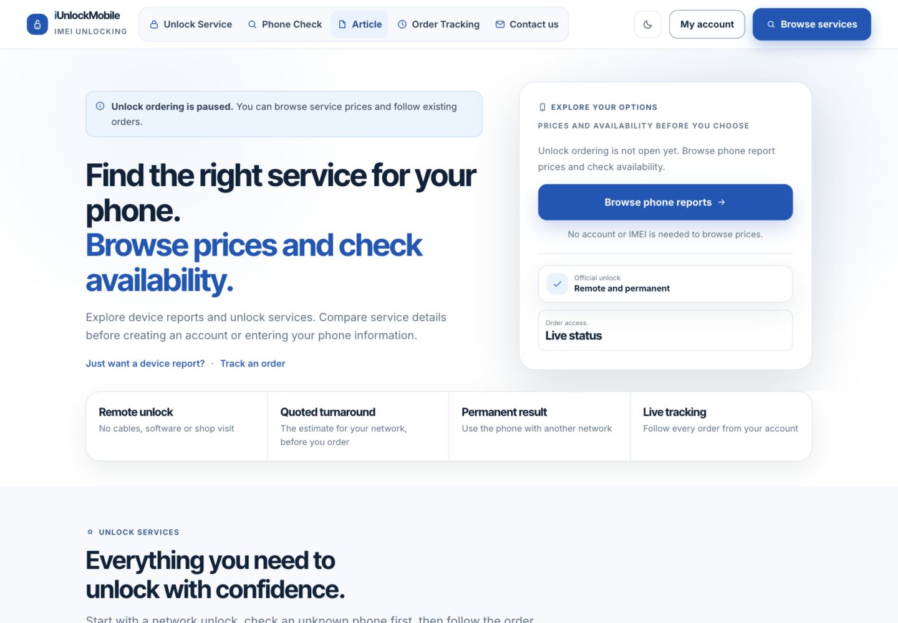
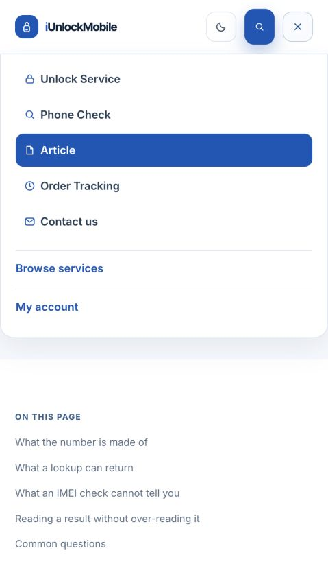

# Navigation and homepage refresh — 8 September 2026

Based on `main` at `da50e80`, preserving the existing article system and the recent admin/provider changes.

## Changes

- Replace How it works and FAQ in the primary navigation with **Article**, linking to `/articles`. Retain the homepage sections and their existing footer links.
- Give the navigation a grouped background, small icons, larger mobile targets and a clear selected state. Article stays highlighted while reading any `/articles/*` page.
- Remove the homepage “IMEI checks and remote unlock services” eyebrow.
- Remove the hero's forced 620px minimum height. Reduce homepage section padding from 104px to at most 64px, with a 28px gap before card grids. Widen the desktop content area and use smaller, readable headings while retaining the mobile card layouts.
- Fit the longer My account label at the 1321px desktop breakpoint without wrapping the header onto a second row.
- Keep article cards within a 320px viewport. Make the entire article heading a link target, including the space between wrapped lines.
- Include the publisher Organization in article JSON-LD alongside the existing Article/BreadcrumbList/FAQPage data. Existing article content, canonical URLs and sitemap entries remain in use.

## Verification

- Production build, lint and 70 tests passed.
- Guest homepage measured at 320, 375, 390, 440, 620, 768, 1024, 1080, 1081, 1280, 1320, 1321, 1366, 1440 and 1920 CSS px.
- Signed-in test account measured at 320, 390, 440, 768, 1024, 1280, 1320, 1321, 1366, 1440 and 1920px: header stays 79px tall; no horizontal document overflow.
- At 1440px the hero is approximately 549px tall and the services section begins around 780px from the document top. Homepage service cards remain one column on phones, two at 768px and three on wider screens.
- Opened Article from navigation, then opened an individual article by clicking its heading. Verified the article title, unique canonical URL, selected Article navigation state and JSON-LD publisher graph.
- Mobile navigation links have at least 48px tap height. Escape closes the menu and returns focus to the toggle. Checked light and dark themes.
- Browser verification used a local production build and an isolated test account/database. These checks do not establish a production deployment or physical-device/Safari coverage.

